# kintsugi-stack-fastapi

> FastAPI Comprehensive Guide: Photo & Video Sharing API


- Source: https://www.youtube.com/watch?v=SR5NYCdzKkc

## Table of contents
- [kintsugi-stack-fastapi](#kintsugi-stack-fastapi)
  - [Table of contents](#table-of-contents)
  - [Project Overview](#project-overview)
  - [Core Concepts of Web Apps and APIs](#core-concepts-of-web-apps-and-apis)
    - [What is an API?](#what-is-an-api)
    - [URLs and Endpoints](#urls-and-endpoints)
    - [The Request and Response Structure](#the-request-and-response-structure)
    - [JWT Authentication Primer](#jwt-authentication-primer)
  - [Environment and Setup](#environment-and-setup)
    - [Project Initialization](#project-initialization)
    - [Installing Dependencies](#installing-dependencies)
    - [Environment Variables (.env)](#environment-variables-env)
  - [Creating the FastAPI Application](#creating-the-fastapi-application)
    - [Scaffolding](#scaffolding)
    - [Creating Your First Endpoint](#creating-your-first-endpoint)
    - [Running the Server with Uvicorn](#running-the-server-with-uvicorn)
    - [Interactive Documentation](#interactive-documentation)
  - [Routing and Parameters](#routing-and-parameters)
    - [Path Parameters](#path-parameters)
    - [Query Parameters](#query-parameters)
  - [Pydantic Schemas and Data Validation](#pydantic-schemas-and-data-validation)
    - [Request Bodies](#request-bodies)
    - [Response Models](#response-models)
  - [Database Setup (SQLAlchemy)](#database-setup-sqlalchemy)
    - [Creating Data Models](#creating-data-models)
    - [Async Engine and Session Initialization](#async-engine-and-session-initialization)
    - [Lifespan Context Manager](#lifespan-context-manager)
  - [Handling Image and Video Uploads \& CRUD Operations (Create, Read, Delete)](#handling-image-and-video-uploads--crud-operations-create-read-delete)
    - [Handling Image and Video Uploads](#handling-image-and-video-uploads)
    - [Integrating ImageKit](#integrating-imagekit)
    - [File Upload Endpoint](#file-upload-endpoint)
    - [CRUD Operations (Create, Read, Delete)](#crud-operations-create-read-delete)
    - [Retrieving Data (Read)](#retrieving-data-read)
    - [Deleting Data](#deleting-data)
    - [Code(s)](#codes)
  - [User Authentication (FastAPI Users)](#user-authentication-fastapi-users)
    - [Database Relationships](#database-relationships)
    - [JWT Strategy and User Manager](#jwt-strategy-and-user-manager)
    - [Injecting Auth Routes](#injecting-auth-routes)
    - [Protecting Endpoints](#protecting-endpoints)
  - [ImageKit API URL Transformations](#imagekit-api-url-transformations)
  - [Front-End Integration (Streamlit context)](#front-end-integration-streamlit-context)


## Project Overview
This project involves building a production-grade, back-end API for a photo and video sharing application, similar to the early days of Instagram. The application allows users to sign in, view a feed of photos and videos (with dates and posting users), and upload media. The backend handles advanced concepts including authentication, authorization, logging in users, connecting to a database, and handling file uploads.

## Core Concepts of Web Apps and APIs

### What is an API?
**API** stands for **Application Programming Interface**. It is essentially a back-end framework running on a secure server that facilitates the access and control of data (like user accounts, image, or video posts). The **front-end** (or **client**) is the visual interface users interact with (e.g., a website). The front-end communicates with the API to perform secure operations. 

### URLs and Endpoints
A **URL** (Uniform Resource Locator) consists of several core components:
*   **Domain**: The website space (e.g., `techwithtim.net`, ending in `.com`, `.net`, etc.).
*   **Path (or Endpoint)**: The specific route, page, or resource being accessed from the domain (e.g., `/courses/python` or `/api/post`). APIs use custom endpoints to control access to particular resources.
*   **Query Parameter**: Extra information used to filter a page or retrieve specific data. It always comes after a question mark `?` and multiple parameters are separated by ampersands `&` (e.g., `?video=123&page=2`).

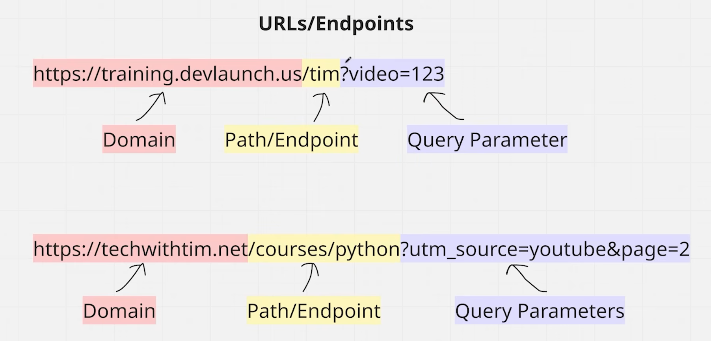

### The Request and Response Structure
The communication flow between a front-end (client) and back-end (API) is handled via **Requests** and **Responses**.

**Request Components (Client to API)**:
*   **Type / Method**: Indicates what the front-end wants to do.
    *   **GET**: Retrieve data.
    *   **POST**: Create new data.
    *   **PUT / PATCH**: Update existing data.
    *   **DELETE**: Delete data.
*   **Path**: The endpoint being accessed.
*   **Body (Optional)**: Additional data sent with the request (e.g., an image being uploaded, a post caption).
*   **Headers**: Additional information, typically related to authentication (e.g., tokens indicating the user is signed in).

**Response Components (API to Client)**:
*   **Status Code**: A number indicating the outcome of the request.
    *   **200**: OK / Successful.
    *   **201**: Created successfully.
    *   **204**: Updated successfully.
    *   **404**: Not found.
    *   **403**: Unauthorized / Permission required.
    *   **500**: Internal server error.
*   **Body**: Additional data returned to the front-end (e.g., the requested post data). Format is often defined by the headers.
*   **Headers**: Security information, authentication details, or data types (e.g., `application/json`).

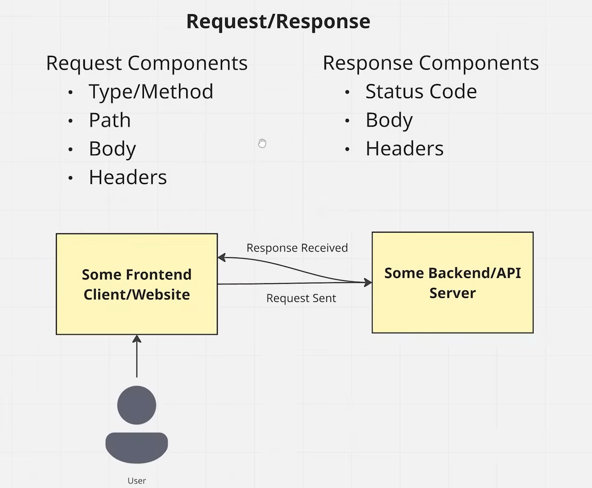

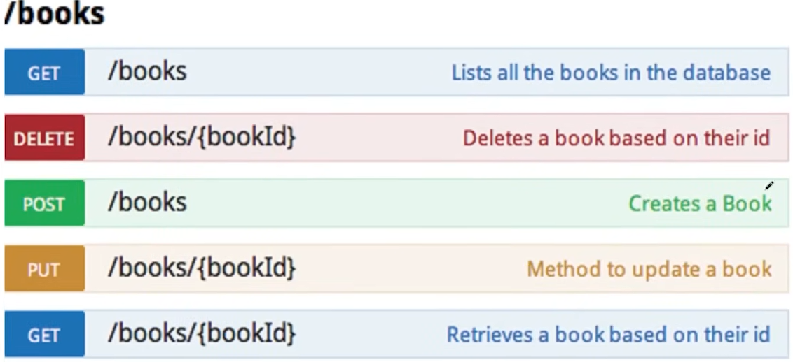 Simple APIs Example

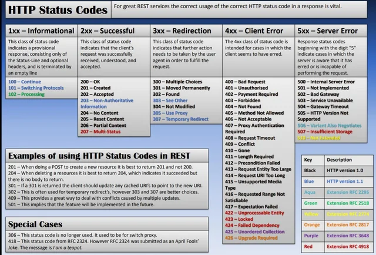

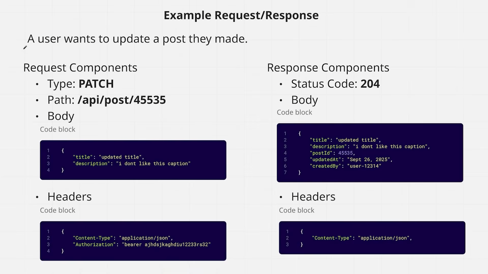

### JWT Authentication Primer
**JWT (JSON Web Tokens)** are used for authenticated APIs to identify users and verify authorizations securely. 
1.  A user logs in by sending their username and password to an authentication endpoint.
2.  The API verifies the credentials and returns a signed **JWT token** (a random string identifying the specific user).
3.  The client stores this token and sends it along in the headers of all future requests.
4.  The API verifies the token on every request to ensure the user has permission to perform the action.

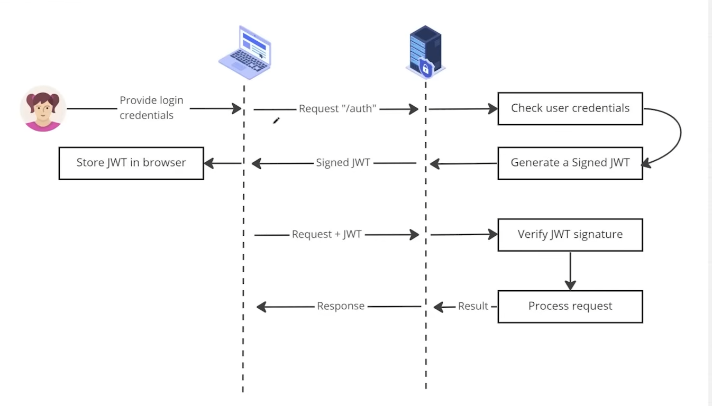

## Environment and Setup

### Project Initialization
It is highly recommended to use **PyCharm** for heavy Python projects due to its support. 
1.  Open a new folder in your editor.
2.  Use a package manager like `uv` (a modern, highly efficient alternative to `pip`) to initialize the project and isolate dependencies.

```bash
python3 -m venv .venv  # creates a virtual environment
source .venv/bin/activate  # activates the virtual environment
pip install uv  # installs a package with pip
pip install -r requirements.txt
```
```bash
uv init .  # initializes project metadata files
```
This creates isolated dependencies in your folder, generating a `main.py` and a `pyproject.toml` file.

### Installing Dependencies
Run the following commands to install necessary dependencies:
```bash
uv add fastapi  # adds this dependency to the project
uv add python-dotenv  # adds this dependency to the project
uv add fastapi-users[sqlalchemy]  # adds this dependency to the project
uv add imagekitio  # adds this dependency to the project
uv add uvicorn[standard]  # adds this dependency to the project
uv add aiosqlite  # adds this dependency to the project
uv add streamlit  # adds this dependency to the project
```

### Environment Variables (.env)
Sensitive credentials, tokens, and keys must be stored in a `.env` file. 

Create an account on **ImageKit** (a free service for hosting, managing, and optimizing images/videos as a Digital Asset Management system). Retrieve the public key, private key (requires account password confirmation), and URL endpoint from the developer options.

Create a `.env` file in the root directory:
```env
IMAGEKIT_PRIVATE_KEY=your_private_key  # stores ImageKit private credential
IMAGEKIT_PUBLIC_KEY=your_public_key  # stores ImageKit public credential
IMAGEKIT_URL_ENDPOINT=your_url_endpoint  # stores ImageKit API endpoint
```

## Creating the FastAPI Application

### Scaffolding
Create a directory named `app` (or `src/app`) to hold the application code, and inside it, create an `app.py` file. This file initializes the FastAPI instance.

```python
from fastapi import FastAPI  # imports FastAPI classes used below

app = FastAPI()  # creates the FastAPI application instance
```

### Creating Your First Endpoint
Endpoints are defined using decorators containing the HTTP method (e.g., `@app.get`) and the path. FastAPI functions typically return a Pydantic object or a Python dictionary (which represents **JSON** - JavaScript Object Notation).

```python
@app.get("/hello-world")  # registers a GET route
def hello_world():  # defines a simple test endpoint
    return {"message": "hello world"}  # returns a JSON message response
```

### Running the Server with Uvicorn
Modify the root `main.py` file to run the application using **Uvicorn**, an asynchronous web server.

```python
import uvicorn  # imports Uvicorn server runner

if __name__ == "__main__":  # checks a condition before next step
    uvicorn.run("app.app:app", host="0.0.0.0", port=8000, reload=True)  # starts ASGI server with app target
```
*   `"app.app:app"`: Targets the `app` variable inside the `app.py` file within the `app` directory.
*   `host="0.0.0.0"`: Runs the server on any available domain (accessible via localhost `127.0.0.1` or the machine's private IP address on the network).
*   `port=8000`: Specifies the port.
*   `reload=True`: Automatically shuts down and restarts the server anytime changes are saved, which is highly useful for debugging.

Run the server via the terminal:
```bash
uv run main.py  # runs the app inside project env
```

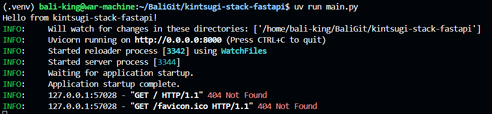

```
http://localhost:8000/  # shows local endpoint URL to open

{"detail":"Not Found"}  # shows sample API JSON response
```

### Interactive Documentation
FastAPI automatically generates comprehensive documentation allowing you to execute and test endpoints directly from the browser.
*   **Swagger UI**: Navigate to `/docs` to see endpoints, configuration, and a "Try it out" button for sending test requests.
*   **ReDoc**: Navigate to `/redoc` for an alternative, modern documentation view.

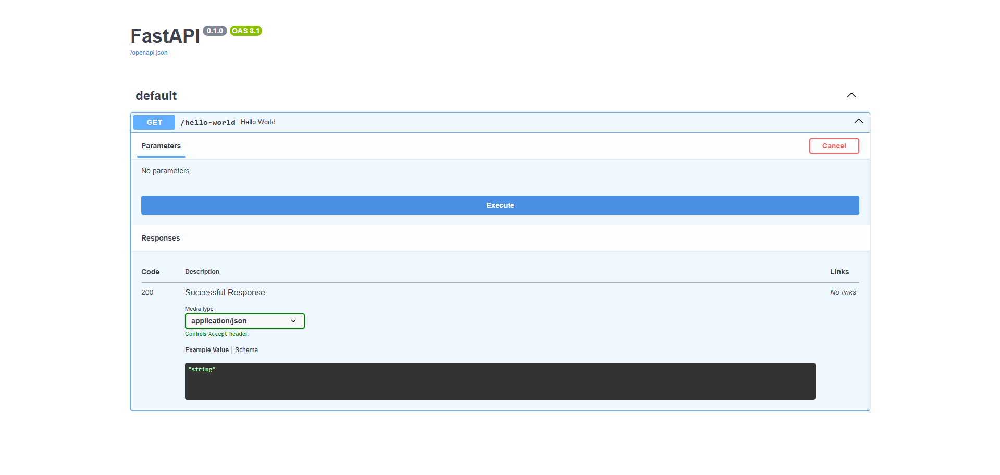
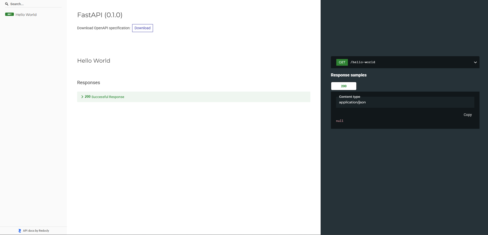


```python
from fastapi import FastAPI   # imports FastAPI classes used below

application = FastAPI()  # creates the FastAPI application instance

@application.get("/hello-world")  # registers a GET route
def hello_world():  # defines a simple test endpoint
    return {"message":"hello world !!!"}  # returns a JSON message response

text_posts = {  # creates in-memory sample post data
    1 : {"title":"new post", "content": "cool test post"}  # shows this line as part of the example output
}  # shows this line as part of the example output

@application.get("/posts")  # registers a GET route
def get_all_posts():  # declares a helper or endpoint function
    return text_posts  # returns data to the API caller
```
```python
import uvicorn  # imports Uvicorn server runner

def main():  # declares a helper or endpoint function
    print("Hello from kintsugi-stack-fastapi!")  # shows this line as part of the example output
    uvicorn.run("src.app:application",host="0.0.0.0",port=8000,reload=True)  # starts ASGI server with app target


if __name__ == "__main__":  # checks a condition before next step
    main()  # shows this line as part of the example output
```

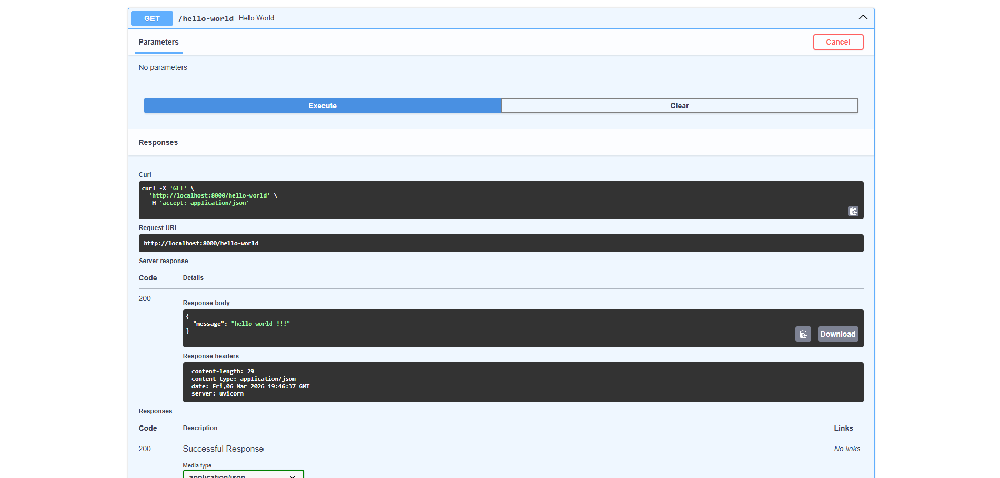
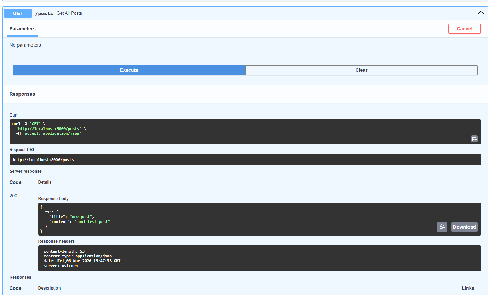

## Routing and Parameters

### Path Parameters
Path parameters are dynamic values placed in the URL (enclosed in curly braces `{}`) to filter specific resources. Providing Python type hints (e.g., `id: int`) enables ` FastAPIs automatic data validation; it will reject invalid data types`.

```python
from fastapi import HTTPException  # imports FastAPI classes used below

text_posts = {1: {"title": "new post", "content": "cool test post"}}  # creates in-memory sample post data

@app.get("/posts/{id}")  # registers a GET route
def get_post(id: int):  # declares a helper or endpoint function
    if id not in text_posts:  # checks whether the post exists
        raise HTTPException(status_code=404, detail="post not found")  # returns an HTTP error for invalid request
    return text_posts.get(id)  # returns data to the API caller
```

```python
from fastapi import FastAPI, HTTPException  # imports FastAPI classes used below

application = FastAPI()  # creates the FastAPI application instance

@application.get("/hello-world")  # registers a GET route
def hello_world():  # defines a simple test endpoint
    return {"message":"hello world !!!"}  # returns a JSON message response

# text_posts = {  # assigns value for later use
#     1 : {"title":"new post", "content": "cool test post"}  # shows this line as part of the example output
# }  # shows this line as part of the example output

text_posts = {  # creates in-memory sample post data
    1: {"title": "Morning Coffee", "content": "Started the day with a strong cup of coffee."},  # shows this line as part of the example output
    2: {"title": "Learning FastAPI", "content": "Building my first API with FastAPI today."},  # shows this line as part of the example output
    3: {"title": "Debugging Code", "content": "Spent an hour fixing a small bug."},  # shows this line as part of the example output
    4: {"title": "New Project Idea", "content": "Thinking about building a health tech platform."},  # shows this line as part of the example output
    5: {"title": "Database Setup", "content": "Installed PostgreSQL and created a new database."},  # shows this line as part of the example output
    6: {"title": "API Testing", "content": "Testing endpoints using Postman."},  # shows this line as part of the example output
    7: {"title": "Late Night Coding", "content": "Still coding at midnight."},  # shows this line as part of the example output
    8: {"title": "Learning Git", "content": "Practicing commits and branches today."},  # shows this line as part of the example output
    9: {"title": "Reading Docs", "content": "Reading FastAPI documentation."},  # shows this line as part of the example output
    10: {"title": "Weekend Build", "content": "Working on a small backend project."}  # shows this line as part of the example output
}  # shows this line as part of the example output

@application.get("/posts")  # registers a GET route
def get_all_posts():  # declares a helper or endpoint function
    return text_posts  # returns data to the API caller

@application.get("/post/{id}")  # registers a GET route
def get_post(id:int):  # declares a helper or endpoint function
    if id not in text_posts:  # checks whether the post exists
        raise HTTPException(status_code=404, detail="post not found")  # returns an HTTP error for invalid request
    return text_posts.get(id)  # returns data to the API caller


```

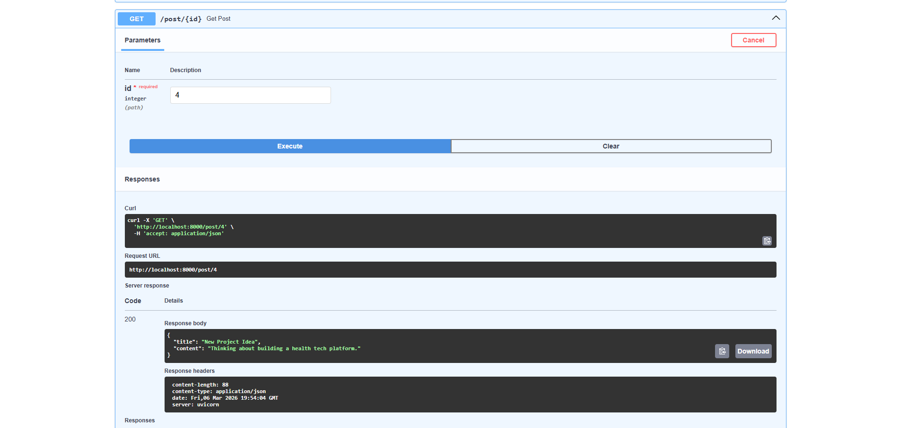

### Query Parameters
Query parameters are optional or mandatory variables passed directly into the endpoint function. Assigning a default value (like `None`) makes them optional.

```python
@application.get("/posts")  # registers a GET route
def get_all_posts(limit: int = None): # here parameter is written because FastAPI will Auto Document it and Validate it | declares a helper or endpoint function
    if limit:  # checks a condition before next step
            return list(text_posts.values())[:limit]  # returns data to the API caller
    return text_posts  # returns data to the API caller
```

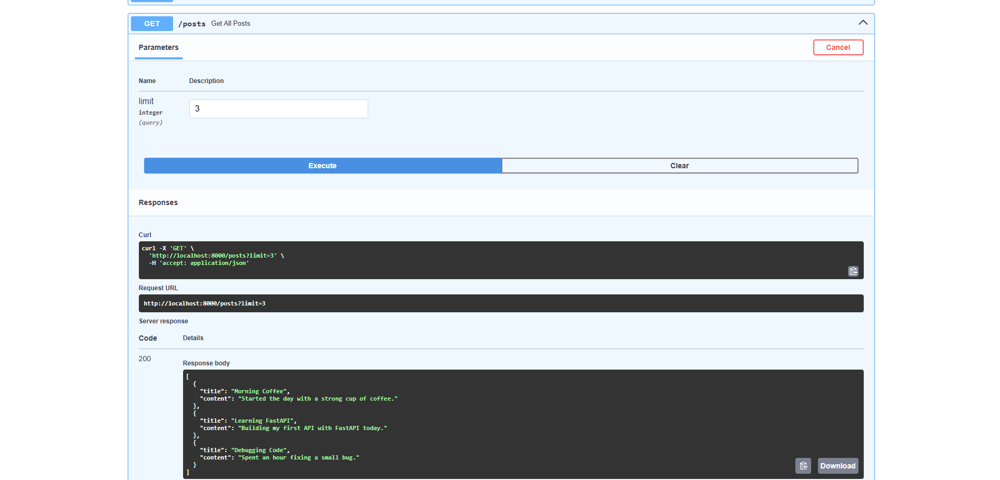

> FastAPI automatically validates all data going into and coming out of the function

## Pydantic Schemas and Data Validation

### Request Bodies
For `POST`, `PUT`, or `PATCH` requests, data is typically sent in the **request body**. FastAPI uses Pydantic **schemas** to define and validate this data structure. Create a `schemas.py` file for these definitions.

```python
# schemas.py  # shows this line as part of the example output
from pydantic import BaseModel  # imports BaseModel for request validation

class PostCreate(BaseModel):  # defines schema for creating posts
    title: str  # requires post title as text
    content: str  # requires post content as text
```

When importing and using this schema in an endpoint, FastAPI strictly validates that ``incoming request bodies match the schema`` types ``before executing the function``.

```python
# app.py  # shows this line as part of the example output
from app.schemas import PostCreate  # imports required names from module

@app.post("/post")  # registers a POST route
def create_post(post: PostCreate):  # declares a helper or endpoint function
    new_id = max(text_posts.keys()) + 1  # assigns value for later use
    new_post = {"title": post.title, "content": post.content}  # assigns value for later use
    text_posts[new_id] = new_post  # assigns value for later use
    return new_post  # returns data to the API caller
```

### Response Models
Specifying a response type using an arrow `->` or the `response_model` parameter improves API documentation (showing exact return formats in `/docs`) and adds a layer of protection. If the function attempts to return data missing fields defined in the response schema, FastAPI automatically raises an error.

---
```py
# schemas.py  # shows this line as part of the example output
from pydantic import BaseModel # BaseModel is special Func. in Python with Special Features | imports BaseModel for request validation

class PostCreate(BaseModel):  # defines schema for creating posts
    title: str  # requires post title as text
    content: str  # requires post content as text

class PostResponse(BaseModel):  # defines schema for post responses
    title: str  # requires post title as text
    content: str  # requires post content as text
```
```py
# app.py  # shows this line as part of the example output
from fastapi import FastAPI, HTTPException  # imports FastAPI classes used below
from src.schemas import PostCreate, PostResponse  # imports required names from module

application = FastAPI()  # creates the FastAPI application instance

@application.get("/hello-world")  # registers a GET route
def hello_world():  # defines a simple test endpoint
    return {"message":"hello world !!!"}  # returns a JSON message response

# text_posts = {  # assigns value for later use
#     1 : {"title":"new post", "content": "cool test post"}  # shows this line as part of the example output
# }  # shows this line as part of the example output

text_posts = {  # creates in-memory sample post data
    1: {"title": "Morning Coffee", "content": "Started the day with a strong cup of coffee."},  # shows this line as part of the example output
    2: {"title": "Learning FastAPI", "content": "Building my first API with FastAPI today."},  # shows this line as part of the example output
    3: {"title": "Debugging Code", "content": "Spent an hour fixing a small bug."},  # shows this line as part of the example output
    4: {"title": "New Project Idea", "content": "Thinking about building a health tech platform."},  # shows this line as part of the example output
    5: {"title": "Database Setup", "content": "Installed PostgreSQL and created a new database."},  # shows this line as part of the example output
    6: {"title": "API Testing", "content": "Testing endpoints using Postman."},  # shows this line as part of the example output
    7: {"title": "Late Night Coding", "content": "Still coding at midnight."},  # shows this line as part of the example output
    8: {"title": "Learning Git", "content": "Practicing commits and branches today."},  # shows this line as part of the example output
    9: {"title": "Reading Docs", "content": "Reading FastAPI documentation."},  # shows this line as part of the example output
    10: {"title": "Weekend Build", "content": "Working on a small backend project."}  # shows this line as part of the example output
}  # shows this line as part of the example output

# @application.get("/posts")  # shows this line as part of the example output
# def get_all_posts():  # shows this line as part of the example output
#     return text_posts  # shows this line as part of the example output

@application.get("/post/{id}")   # registers a GET route
def get_post(id:int)-> PostResponse:  # declares a helper or endpoint function
    if id not in text_posts:  # checks whether the post exists
        raise HTTPException(status_code=404, detail="post not found")  # returns an HTTP error for invalid request
    return text_posts.get(id)  # returns data to the API caller

@application.get("/posts")  # registers a GET route
def get_all_posts(limit: int = None)  : # here parameter is written because FastAPI will Auto Document it and Validate it | declares a helper or endpoint function
    if limit:  # checks a condition before next step
            return list(text_posts.values())[:limit]  # returns data to the API caller
    return text_posts  # returns data to the API caller

@application.post("/post")  # registers a POST route
def create_post(post_body: PostCreate) -> PostResponse : # validates incoming (PostCreate) and Outgoing (PostResponse), if not valid so raise error | declares a helper or endpoint function
    new_id = max(text_posts.keys()) + 1  # assigns value for later use
    new_post = { "title": post_body.title , "content" : post_body.content }  # assigns value for later use
    text_posts[new_id] = new_post  # assigns value for later use
    return new_post  # returns data to the API caller
```

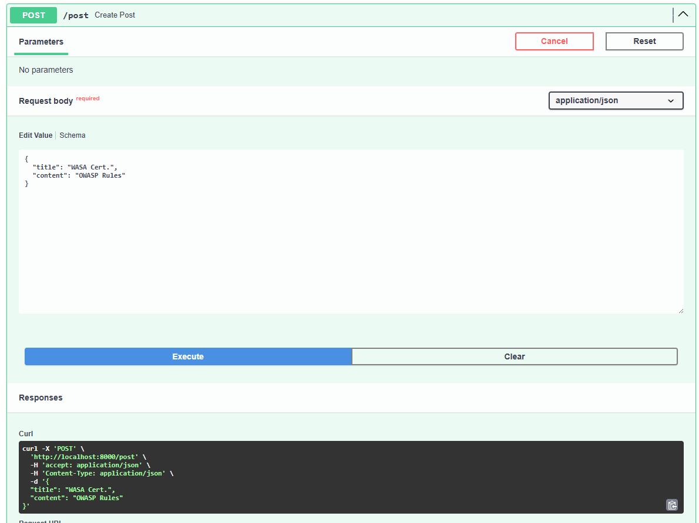 try create post
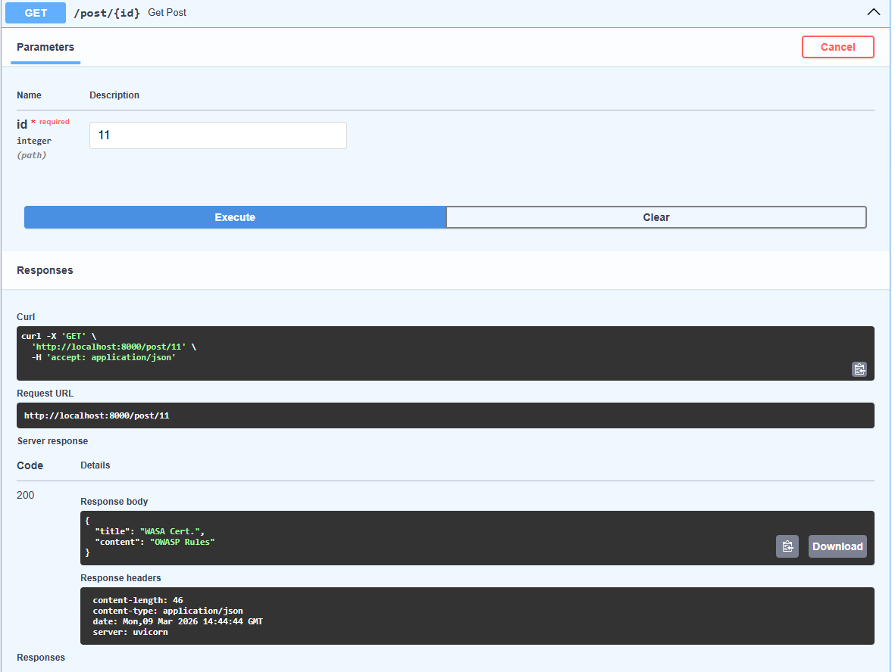 access that post

## Database Setup (SQLAlchemy)

To store data persistently (preventing data loss on server refresh), an **ORM (Object Relational Mapping)** is used. SQLAlchemy allows writing Python-like code to define, retrieve, create, and update data instead of writing manual SQL queries.

### Creating Data Models
Create a `db.py` file to handle database architecture. The `Base` class must inherit from `DeclarativeBase` to mark classes as data models.

```python
# db.py  # shows this line as part of the example output
import uuid  # imports UUID helper for unique IDs
from datetime import datetime  # imports datetime for timestamps
from sqlalchemy import Column, String, Text, DateTime, ForeignKey  # imports SQLAlchemy column and query tools
from sqlalchemy.dialects.postgresql import UUID  # imports PostgreSQL UUID column type
from sqlalchemy.orm import DeclarativeBase, relationship  # imports ORM base and relationships

class Base(DeclarativeBase):  # declares a class used by the app
    pass  # shows this line as part of the example output
# we can't directly use declarative_base() because we need to use it in async way, so we create a class that inherits from DeclarativeBase and then we can use it to create our models

class Post(Base):  # declares a class used by the app
    __tablename__ = "post"  # assigns value for later use
    
    # Primary Key must be unique. Automatically generates a unique UUID4. | shows this line as part of the example output
    id = Column(UUID(as_uuid=True), primary_key=True, default=uuid.uuid4)  # assigns value for later use
    caption = Column(Text)  # assigns value for later use
    url = Column(String, nullable=False)  # assigns value for later use
    file_type = Column(String, nullable=False)  # assigns value for later use
    file_name = Column(String, nullable=False)  # assigns value for later use
    created_at = Column(DateTime, default=datetime.utcnow)  # assigns value for later use
```
*Note: A primary key represents the unique lookup entity for an entry in the database.*

### Async Engine and Session Initialization
Configure the connection to an asynchronous SQLite database locally for testing. 

```python
# db.py  # shows this line as part of the example output
from sqlalchemy.ext.asyncio import create_async_engine, async_sessionmaker, AsyncSession  # imports async database session utilities
from collections.abc import AsyncGenerator  # imports async generator typing

DATABASE_URL = "sqlite+aiosqlite:///./test.db"  # sets async SQLite database location

engine = create_async_engine(DATABASE_URL)  # creates async SQLAlchemy engine
async_session_maker = async_sessionmaker(engine, expire_on_commit=False)  # builds async DB session factory

# Creates tables in the database automatically finding classes inheriting from Base  # shows this line as part of the example output
async def create_db_and_tables():  # creates database tables at startup
    async with engine.begin() as conn:  # shows this line as part of the example output
        await conn.run_sync(Base.metadata.create_all)  # waits for async operation to finish

# Asynchronous generator to yield a database session  # shows this line as part of the example output
async def get_async_session() -> AsyncGenerator[AsyncSession, None]:  # provides one DB session per request
    async with async_session_maker() as session:  # shows this line as part of the example output
        yield session  # shows this line as part of the example output
```

### Lifespan Context Manager
In `app.py`, link the table creation to the FastAPI startup process using a lifespan asynchronous context manager. This guarantees the database is ready when the server boots.

```python
# app.py  # shows this line as part of the example output
from contextlib import asynccontextmanager  # imports required names from module
from app.db import create_db_and_tables  # imports required names from module

@asynccontextmanager  # applies decorator behavior to next function
async def lifespan(app: FastAPI):  # declares an async endpoint/helper
    await create_db_and_tables()  # waits for async operation to finish
    yield  # shows this line as part of the example output

app = FastAPI(lifespan=lifespan)  # creates the FastAPI application instance
```

> if `test.db` is generated, our db unfinished script is working

---

```py
# db.py
from collections.abc import AsyncGenerator
from datetime import datetime
import uuid 
from sqlalchemy import Column, String, Text, DateTime, ForeignKey
from sqlalchemy.dialects.postgresql import UUID
from sqlalchemy.ext.asyncio import AsyncSession, create_async_engine, async_sessionmaker
from sqlalchemy.orm import DeclarativeBase, relationship

DATABASE_URL = "sqlite+aiosqlite:///./test.db"

class Base(DeclarativeBase): # we can't directly use declarative_base() because we need to use it in async way, so we create a class that inherits from DeclarativeBase and then we can use it to create our models
    pass

class Post(Base):
    __tablename__ = "posts"
    id = Column(UUID(as_uuid=True),primary_key=True, default=uuid.uuid4)
    caption = Column(Text)
    url = Column(String, nullable=False)
    file_type = Column(String, nullable= False)
    file_name = Column(String, nullable=False)
    created_at = Column(DateTime, default=datetime.utcnow)

engine = create_async_engine(DATABASE_URL)
async_session_maker = async_sessionmaker(engine, expire_on_commit=False)

async def create_db_and_tables():
    async with engine.begin() as conn:
        await conn.run_sync(Base.metadata.create_all)

async def get_async_session() -> AsyncGenerator[AsyncSession, None]:
    async with async_session_maker() as session:
        yield session


```
```py
# app.py
from fastapi import FastAPI, HTTPException
from src.schemas import PostCreate, PostResponse
from src.db import Post, create_db_and_tables, get_async_session
from sqlalchemy.ext.asyncio import AsyncSession
from contextlib import asynccontextmanager

@asynccontextmanager
async def lifespan(app: FastAPI):
    await create_db_and_tables()
    yield

application = FastAPI(lifespan=lifespan)

@application.get("/hello-world")
def hello_world():
    return {"message":"hello world !!!"}

# text_posts = {
#     1 : {"title":"new post", "content": "cool test post"}
# }

text_posts = {
    1: {"title": "Morning Coffee", "content": "Started the day with a strong cup of coffee."},
    2: {"title": "Learning FastAPI", "content": "Building my first API with FastAPI today."},
    3: {"title": "Debugging Code", "content": "Spent an hour fixing a small bug."},
    4: {"title": "New Project Idea", "content": "Thinking about building a health tech platform."},
    5: {"title": "Database Setup", "content": "Installed PostgreSQL and created a new database."},
    6: {"title": "API Testing", "content": "Testing endpoints using Postman."},
    7: {"title": "Late Night Coding", "content": "Still coding at midnight."},
    8: {"title": "Learning Git", "content": "Practicing commits and branches today."},
    9: {"title": "Reading Docs", "content": "Reading FastAPI documentation."},
    10: {"title": "Weekend Build", "content": "Working on a small backend project."}
}

# @application.get("/posts")
# def get_all_posts():
#     return text_posts

@application.get("/post/{id}") 
def get_post(id:int)-> PostResponse:
    if id not in text_posts:
        raise HTTPException(status_code=404, detail="post not found")
    return text_posts.get(id)

@application.get("/posts")
def get_all_posts(limit: int = None)  : # here parameter is written because FastAPI will Auto Document it and Validate it
    if limit:
            return list(text_posts.values())[:limit]
    return text_posts

@application.post("/post")
def create_post(post_body: PostCreate) -> PostResponse : # validates incoming (PostCreate) and Outgoing (PostResponse), if not valid so raise error
    new_id = max(text_posts.keys()) + 1
    new_post = { "title": post_body.title , "content" : post_body.content }
    text_posts[new_id] = new_post
    return new_post
```

## Handling Image and Video Uploads & CRUD Operations (Create, Read, Delete)

### Handling Image and Video Uploads

comment old stuff, for a rewamp
```py

# old stuff rewamp

# @application.get("/hello-world")
# def hello_world():
#     return {"message":"hello world !!!"}

# # text_posts = {
# #     1 : {"title":"new post", "content": "cool test post"}
# # }

# text_posts = {
#     1: {"title": "Morning Coffee", "content": "Started the day with a strong cup of coffee."},
#     2: {"title": "Learning FastAPI", "content": "Building my first API with FastAPI today."},
#     3: {"title": "Debugging Code", "content": "Spent an hour fixing a small bug."},
#     4: {"title": "New Project Idea", "content": "Thinking about building a health tech platform."},
#     5: {"title": "Database Setup", "content": "Installed PostgreSQL and created a new database."},
#     6: {"title": "API Testing", "content": "Testing endpoints using Postman."},
#     7: {"title": "Late Night Coding", "content": "Still coding at midnight."},
#     8: {"title": "Learning Git", "content": "Practicing commits and branches today."},
#     9: {"title": "Reading Docs", "content": "Reading FastAPI documentation."},
#     10: {"title": "Weekend Build", "content": "Working on a small backend project."}
# }

# # @application.get("/posts")
# # def get_all_posts():
# #     return text_posts

# @application.get("/post/{id}") 
# def get_post(id:int)-> PostResponse:
#     if id not in text_posts:
#         raise HTTPException(status_code=404, detail="post not found")
#     return text_posts.get(id)

# @application.get("/posts")
# def get_all_posts(limit: int = None)  : # here parameter is written because FastAPI will Auto Document it and Validate it
#     if limit:
#             return list(text_posts.values())[:limit]
#     return text_posts

# @application.post("/post")
# def create_post(post_body: PostCreate) -> PostResponse : # validates incoming (PostCreate) and Outgoing (PostResponse), if not valid so raise error
#     new_id = max(text_posts.keys()) + 1
#     new_post = { "title": post_body.title , "content" : post_body.content }
#     text_posts[new_id] = new_post
#     return new_post
```

### Integrating ImageKit
Create an `images.py` file to handle environment variables and ImageKit initialization. Variables are loaded exclusively on the back-end to prevent front-end security token exposure.

```python
# images.py  # shows this line as part of the example output
import os  # imports required module
from dotenv import load_dotenv  # loads environment values from .env
from imagekitio import ImageKit  # imports ImageKit client

load_dotenv()  # loads environment variables into runtime

imagekit = ImageKit(  # initializes ImageKit API client
    private_key=os.getenv("IMAGEKIT_PRIVATE_KEY"),  # reads private key from environment
    public_key=os.getenv("IMAGEKIT_PUBLIC_KEY"),  # reads public key from environment
    url_endpoint=os.getenv("IMAGEKIT_URL_ENDPOINT")  # reads URL endpoint from environment
)  # shows this line as part of the example output
```

### File Upload Endpoint
Uploads require `multipart/form-data` instead of standard JSON request bodies. FastAPIs `UploadFile` receives the file object.

Because server-side uploading (Backend Upload) is more secure, the API receives the file, duplicates it to a temporary file, uploads it to ImageKit, and then deletes the local temporary file.

```python
# app.py  # shows this line as part of the example output
import tempfile  # imports required module
import shutil  # imports required module
import os  # imports required module
from fastapi import File, UploadFile, Form, Depends, HTTPException  # imports FastAPI classes used below
from sqlalchemy.ext.asyncio import AsyncSession  # imports async database session utilities
from imagekitio.models.UploadFileRequestOptions import UploadFileRequestOptions  # imports required names from module

from app.db import Post, get_async_session  # imports required names from module
from app.images import imagekit  # imports required names from module

@app.post("/upload")  # registers a POST route
async def upload_file(  # declares an async endpoint/helper
    file: UploadFile = File(...),   # assigns value for later use
    caption: str = Form(...),   # assigns value for later use
    session: AsyncSession = Depends(get_async_session)  # assigns value for later use
):  # shows this line as part of the example output
    temp_file_path = None  # assigns value for later use
    try:  # starts protected block for upload flow
        # Create temporary file matching the extension of the uploaded file | shows this line as part of the example output
        _, ext = os.path.splitext(file.filename)  # assigns value for later use
        with tempfile.NamedTemporaryFile(delete=False, suffix=ext) as temp_file:  # creates temporary file for upload
            temp_file_path = temp_file.name  # assigns value for later use
            shutil.copyfileobj(file.file, temp_file)  # shows this line as part of the example output
            
        # Upload the temporary file to ImageKit | shows this line as part of the example output
        with open(temp_file_path, "rb") as f:  # reopens temp file in binary mode
            options = UploadFileRequestOptions(use_unique_file_name=True, tags=["backend_upload"])  # assigns value for later use
            upload_result = imagekit.upload_file(  # assigns value for later use
                file=f,  # assigns value for later use
                file_name=file.filename,  # assigns value for later use
                options=options  # assigns value for later use
            )  # shows this line as part of the example output
            
        if upload_result.response_metadata.http_status_code == 200:  # checks a condition before next step
            file_type = "video" if file.content_type.startswith("video/") else "image"  # assigns value for later use
            
            # Database storage operations | shows this line as part of the example output
            post = Post(  # assigns value for later use
                caption=caption,  # assigns value for later use
                url=upload_result.url,  # assigns value for later use
                file_type=file_type,  # assigns value for later use
                file_name=upload_result.name  # assigns value for later use
            )  # shows this line as part of the example output
            session.add(post)  # shows this line as part of the example output
            await session.commit()  # waits for async operation to finish
            await session.refresh(post) # Hydrates object with auto-generated ID & created_at | waits for async operation to finish
            
            return post  # returns data to the API caller
            
    except Exception as e:  # handles unexpected runtime errors
        raise HTTPException(status_code=500, detail=str(e))  # returns an HTTP error for invalid request
    finally:  # ensures cleanup always executes
        # Clean up file structures to avoid memory leaks | shows this line as part of the example output
        if temp_file_path and os.path.exists(temp_file_path):  # checks a condition before next step
            os.unlink(temp_file_path)  # shows this line as part of the example output
        file.file.close()  # shows this line as part of the example output
```
*Note: `Depends(get_async_session)` is an example of Dependency Injection. It runs the provided function and passes the return value dynamically as a variable into the endpoint.*

### CRUD Operations (Create, Read, Delete)

### Retrieving Data (Read)
Use SQLAlchemy's `select` to query the database. To extract results dynamically, loop over the rows or use `.scalars().all()`.

```python
from sqlalchemy import select  # imports SQLAlchemy column and query tools

@app.get("/feed")  # registers a GET route
async def get_feed(session: AsyncSession = Depends(get_async_session)):  # declares an async endpoint/helper
    result = await session.execute(select(Post).order_by(Post.created_at.desc()))  # assigns value for later use
    posts = [row for row in result.all()]  # assigns value for later use
    
    post_data = []  # assigns value for later use
    for post in posts:  # shows this line as part of the example output
        post_data.append({  # shows this line as part of the example output
            "id": str(post.id),  # shows this line as part of the example output
            "caption": post.caption,  # shows this line as part of the example output
            "url": post.url,  # shows this line as part of the example output
            "file_type": post.file_type,  # shows this line as part of the example output
            "file_name": post.file_name,  # shows this line as part of the example output
            "created_at": post.created_at.isoformat()  # shows this line as part of the example output
        })  # shows this line as part of the example output
    return post_data  # returns data to the API caller
```

### Deleting Data
Requires verifying exact matches (converting strings to UUIDs where necessary).

```python
import uuid  # imports UUID helper for unique IDs

@app.delete("/post/{post_id}")  # registers a DELETE route
async def delete_post(post_id: str, session: AsyncSession = Depends(get_async_session)):  # declares an async endpoint/helper
    try:  # starts protected block for upload flow
        post_uuid = uuid.UUID(post_id)  # assigns value for later use
        result = await session.execute(select(Post).where(Post.id == post_uuid))  # assigns value for later use
        post = result.scalars().first()  # assigns value for later use
        
        if not post:  # checks a condition before next step
            raise HTTPException(status_code=404, detail="post not found")  # returns an HTTP error for invalid request
            
        await session.delete(post)  # waits for async operation to finish
        await session.commit()  # waits for async operation to finish
        
        return {"success": True, "message": "post deleted successfully"}  # returns data to the API caller
    except Exception as e:  # handles unexpected runtime errors
        raise HTTPException(status_code=500, detail=str(e))  # returns an HTTP error for invalid request
```

### Code(s)

---

next part

```py
# db.py
from collections.abc import AsyncGenerator
from datetime import datetime
import uuid 
from sqlalchemy import Column, String, Text, DateTime, ForeignKey
from sqlalchemy.dialects.postgresql import UUID
from sqlalchemy.ext.asyncio import AsyncSession, create_async_engine, async_sessionmaker
from sqlalchemy.orm import DeclarativeBase, relationship

DATABASE_URL = "sqlite+aiosqlite:///./test.db"

class Base(DeclarativeBase): # we can't directly use declarative_base() because we need to use it in async way, so we create a class that inherits from DeclarativeBase and then we can use it to create our models
    pass

class Post(Base):
    __tablename__ = "posts"
    id = Column(UUID(as_uuid=True),primary_key=True, default=uuid.uuid4)
    caption = Column(Text)
    url = Column(String, nullable=False)
    file_type = Column(String, nullable= False)
    file_name = Column(String, nullable=False)
    created_at = Column(DateTime, default=datetime.utcnow)

engine = create_async_engine(DATABASE_URL)
async_session_maker = async_sessionmaker(engine, expire_on_commit=False)

async def create_db_and_tables():
    async with engine.begin() as conn:
        await conn.run_sync(Base.metadata.create_all)

async def get_async_session() -> AsyncGenerator[AsyncSession, None]:
    async with async_session_maker() as session:
        yield session


```
```py
# app.py
from fastapi import FastAPI, HTTPException, File, UploadFile, Depends, Form
from src.schemas import PostCreate, PostResponse
from src.db import Post, create_db_and_tables, get_async_session
from sqlalchemy.ext.asyncio import AsyncSession
from sqlalchemy import select
from contextlib import asynccontextmanager

@asynccontextmanager
async def lifespan(app: FastAPI):
    await create_db_and_tables() # create db for us, and make sure  this is essentially handled correctly and cleanly . at time of exit, it will close the connection to the database, so that we don't have any connection leaks, and we can ensure that our application is properly cleaned up when it shuts down.
    yield

application = FastAPI(lifespan=lifespan)

@application.post("/upload") # using async, fastapi is async framework
async def upload_file(
    file: UploadFile = File(...),
    caption: str = Form(""),
    session: AsyncSession = Depends(get_async_session) # FastAPI Dependency Injection, it will automatically create a new session for each request and close it after the request is done
) : 
    post = Post( # dummy post 
        caption = caption,
        url = "dummy url",
        file_type = "photo",
        file_name = "dummy name"
    )

    session.add(post) # like staging, post is added to session but not saved
    await session.commit() # like commit, saving the post to the database
    # id and created_at are generated by the database, so we need to refresh the post object to get the updated data from the database, because after commit, the post object is not updated with the data from the database, so we need to refresh it to get the id of the post
    # after commit, the post object is not updated with the data from the database, so we need to refresh it to get the id of the post
    await session.refresh(post) # like refresh, refreshing the post object with the data from the database, so that we can get the id of the post
    return post

@application.get("/feed")
async def get_feed(
    session: AsyncSession = Depends(get_async_session)
):
    result = await session.execute(select(Post).order_by(Post.created_at.desc())) # like select * from posts order by created_at desc, it will return a list of Post objects
    posts = [row[0] for row in result.all()] # result.all() will return a list of tuples, where each tuple contains a single Post object, so we need to extract the Post object from the tuple using row[0]
    # cursor object is returned by the database, and we need to convert it to a list of Post objects, so that we can return it as a response

    posts_data = []
    for post in posts:
        posts_data.append({
            "id":str(post.id),
            "caption":post.caption,
            "url":post.url,
            "file_type":post.file_type,
            "file_name":post.file_name,
            "created_at":post.created_at.isoformat()
        })
    
    return {"posts": posts_data}

    


# old stuff rewamp

# @application.get("/hello-world")
# def hello_world():
#     return {"message":"hello world !!!"}

# # text_posts = {
# #     1 : {"title":"new post", "content": "cool test post"}
# # }

# text_posts = {
#     1: {"title": "Morning Coffee", "content": "Started the day with a strong cup of coffee."},
#     2: {"title": "Learning FastAPI", "content": "Building my first API with FastAPI today."},
#     3: {"title": "Debugging Code", "content": "Spent an hour fixing a small bug."},
#     4: {"title": "New Project Idea", "content": "Thinking about building a health tech platform."},
#     5: {"title": "Database Setup", "content": "Installed PostgreSQL and created a new database."},
#     6: {"title": "API Testing", "content": "Testing endpoints using Postman."},
#     7: {"title": "Late Night Coding", "content": "Still coding at midnight."},
#     8: {"title": "Learning Git", "content": "Practicing commits and branches today."},
#     9: {"title": "Reading Docs", "content": "Reading FastAPI documentation."},
#     10: {"title": "Weekend Build", "content": "Working on a small backend project."}
# }

# # @application.get("/posts")
# # def get_all_posts():
# #     return text_posts

# @application.get("/post/{id}") 
# def get_post(id:int)-> PostResponse:
#     if id not in text_posts:
#         raise HTTPException(status_code=404, detail="post not found")
#     return text_posts.get(id)

# @application.get("/posts")
# def get_all_posts(limit: int = None)  : # here parameter is written because FastAPI will Auto Document it and Validate it
#     if limit:
#             return list(text_posts.values())[:limit]
#     return text_posts

# @application.post("/post")
# def create_post(post_body: PostCreate) -> PostResponse : # validates incoming (PostCreate) and Outgoing (PostResponse), if not valid so raise error
#     new_id = max(text_posts.keys()) + 1
#     new_post = { "title": post_body.title , "content" : post_body.content }
#     text_posts[new_id] = new_post
#     return new_post
```

uploading sample document
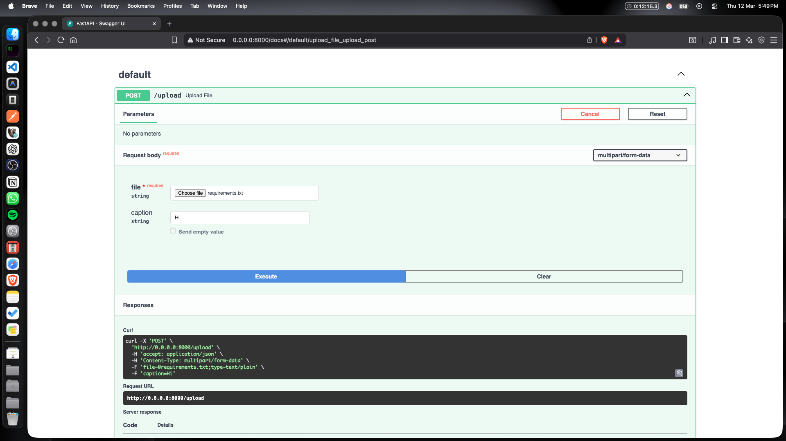
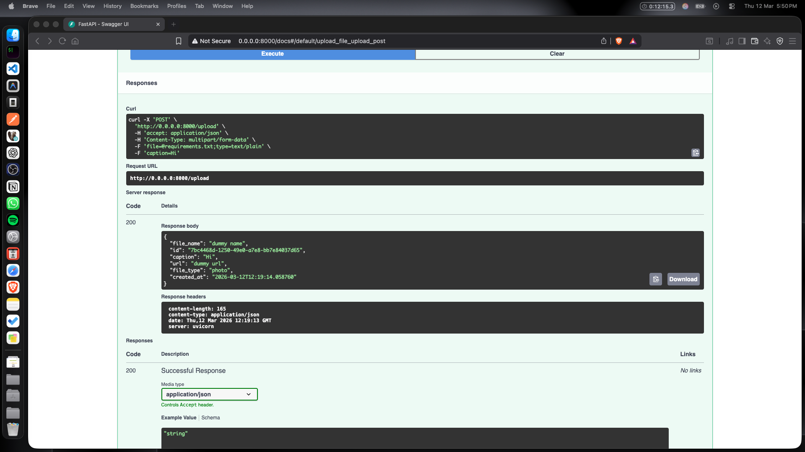

even if we exit application, db get saved, once we restart application, db gets restored !!!

after reopning the application, db restored, and get api worked !!!
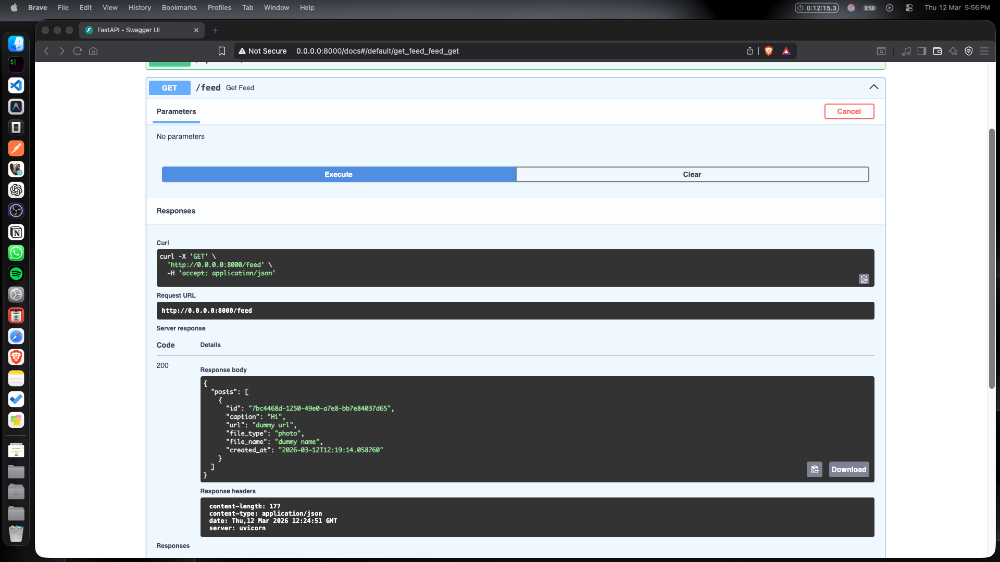

---

next part

You can use External Storage

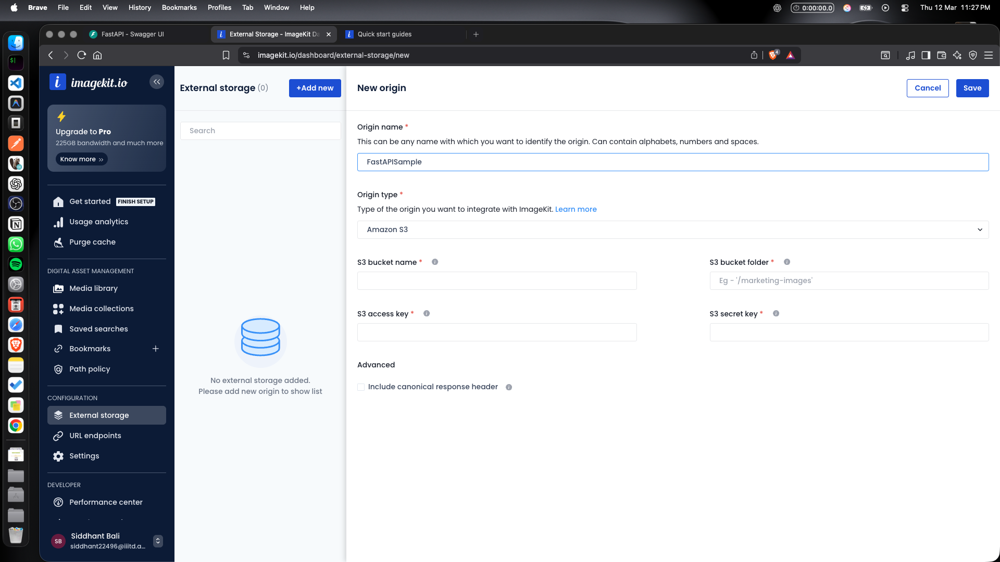

But Rn, using Imagekit's DAM 

- Use this doc: https://imagekit.io/docs/integration/python

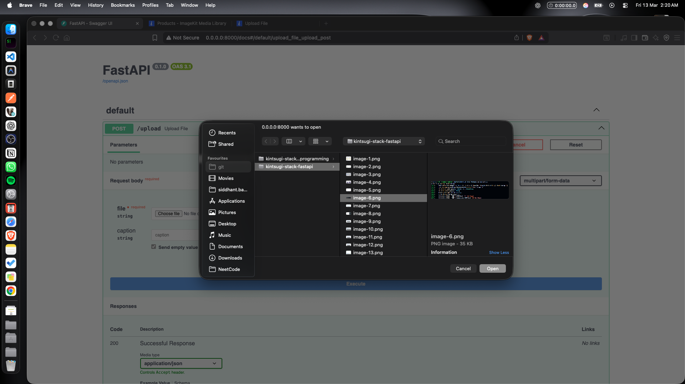
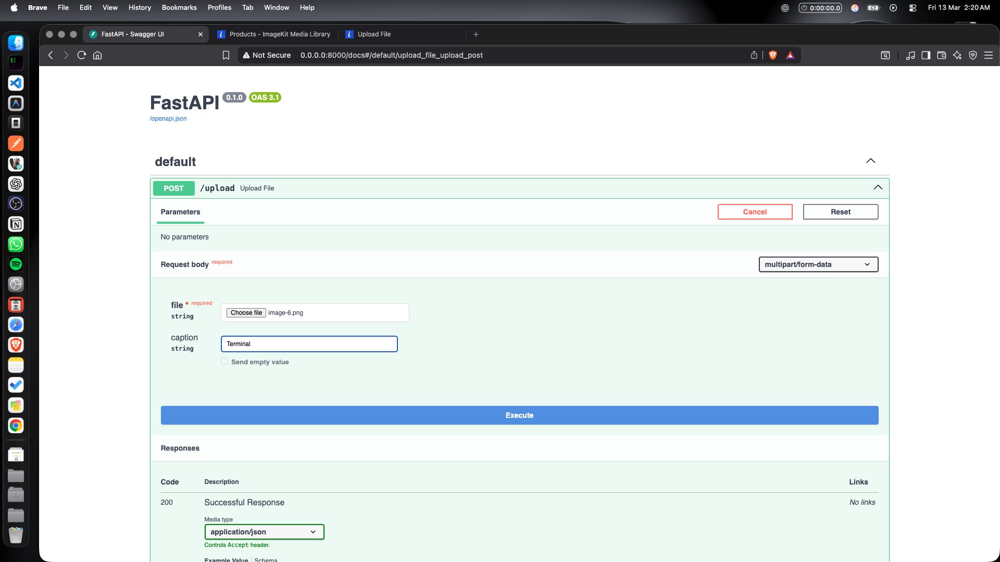
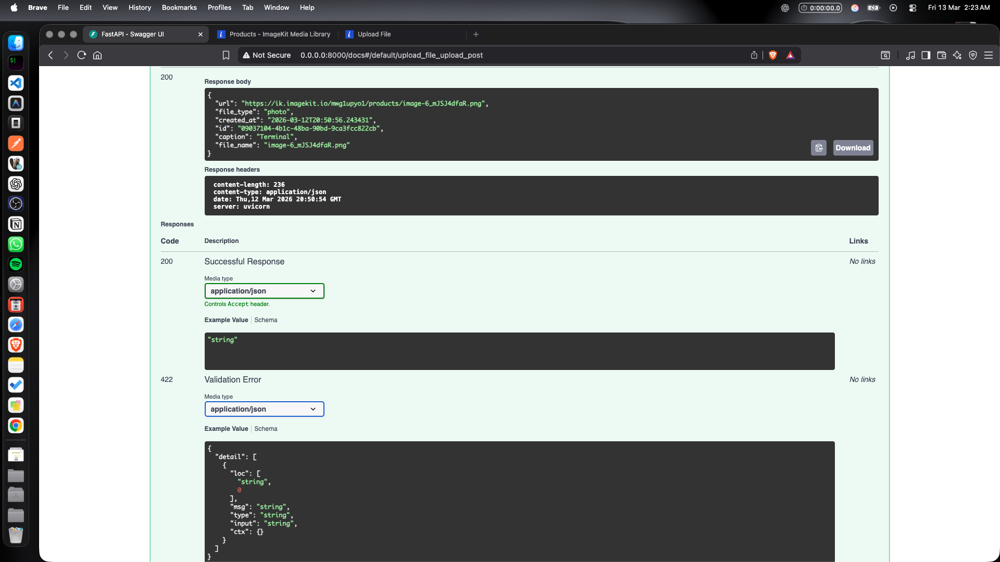 schema not error

Now Post Stored in DB and Image linked stored in DAM
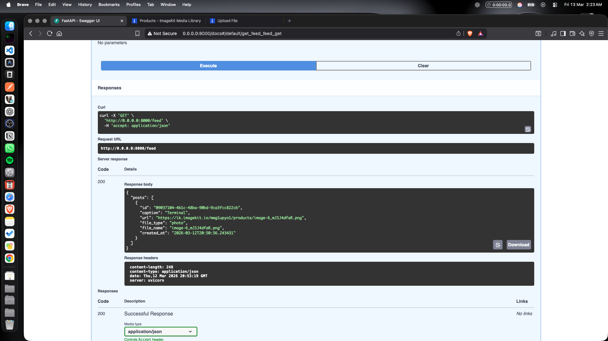
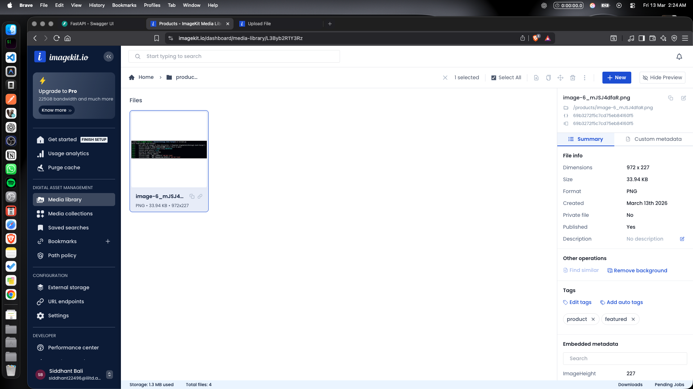
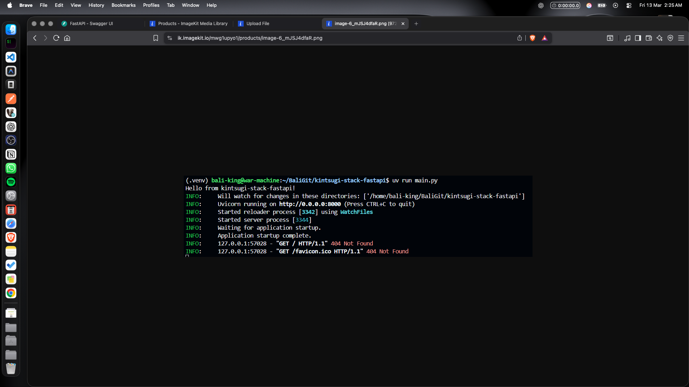

```bash
pip install imagekitio
```

```py
# images.py
from dotenv import load_dotenv
from imagekitio import ImageKit
import os

load_dotenv()

imagekit = ImageKit(
    private_key=os.getenv("IMAGEKIT_PRIVATE_KEY"),
    # public_key=os.getenv("IMAGEKIT_PUBLIC_KEY"), # old
    # url_endpoint=os.getenv("IMAGEKIT_URL_ENDPOINT") # old
)

# Store URL endpoint for reuse
URL_ENDPOINT = os.environ.get("IMAGEKIT_URL_ENDPOINT")

# uv pip install imagekitio==5.2.0
# imagekit is a client library for ImageKit, which is a cloud-based image and video management service. It provides a simple and easy-to-use interface for uploading, transforming, and delivering images and videos.
```

```py
# app.py
from fastapi import FastAPI, HTTPException, File, UploadFile, Depends, Form
from src.schemas import PostCreate, PostResponse
from src.db import Post, create_db_and_tables, get_async_session
from sqlalchemy.ext.asyncio import AsyncSession
from sqlalchemy import select
from contextlib import asynccontextmanager
from src.images import imagekit
# from imagekitio.models.UploadFileRequestOptions import UploadFileRequestOptions
import shutil
import os
import uuid
import tempfile

@asynccontextmanager
async def lifespan(app: FastAPI):
    await create_db_and_tables() # create db for us, and make sure  this is essentially handled correctly and cleanly . at time of exit, it will close the connection to the database, so that we don't have any connection leaks, and we can ensure that our application is properly cleaned up when it shuts down.
    yield

application = FastAPI(lifespan=lifespan)

@application.post("/upload") # using async, fastapi is async framework
async def upload_file(
    file: UploadFile = File(...),
    caption: str = Form(""),
    session: AsyncSession = Depends(get_async_session) # FastAPI Dependency Injection, it will automatically create a new session for each request and close it after the request is done
) : 

    temp_file_path = None
    try: 
        with tempfile.NamedTemporaryFile(delete=False, suffix=os.path.splitext(file.filename)[1]) as temp_file:
            temp_file_path = temp_file.name
            shutil.copyfileobj(file.file, temp_file)
        
        upload_result = imagekit.files.upload(
        # upload_result = imagekit.upload_file( # old

            file=open(temp_file_path, "rb"),
            file_name=file.filename,
            folder="/products",
            tags=["product", "featured"]
            # options=UploadFileRequestOptions( # old
            #     use_unique_file_name=True,
            #     tags=["backend-upload"]
            # )
        )
        if upload_result and upload_result.url :
        # if upload_result.status_code == 200: # old
            post = Post( 
                # dummy post 
                caption = caption,
                # url = "dummy url",
                url = upload_result.url,
                # file_type = "photo",
                file_type = "video" if file.content_type.startswith("video/") else "photo",
                # file_name = "dummy name"
                file_name = upload_result.name
            )
            session.add(post)
            await session.commit()
            await session.refresh(post)
            return post
    except Exception as e:
        raise HTTPException(status_code=500, detail=str(e))
        # pass
    finally:
        if temp_file_path and os.path.exists(temp_file_path):
            os.unlink(temp_file_path)
        file.file.close()


    # dummy
    # post = Post( # dummy post 
    #     caption = caption,
    #     url = "dummy url",
    #     file_type = "photo",
    #     file_name = "dummy name"
    # )
    # session.add(post) # like staging, post is added to session but not saved
    # await session.commit() # like commit, saving the post to the database
    # # id and created_at are generated by the database, so we need to refresh the post object to get the updated data from the database, because after commit, the post object is not updated with the data from the database, so we need to refresh it to get the id of the post
    # # after commit, the post object is not updated with the data from the database, so we need to refresh it to get the id of the post
    # await session.refresh(post) # like refresh, refreshing the post object with the data from the database, so that we can get the id of the post
    # return post

@application.get("/feed")
async def get_feed(
    session: AsyncSession = Depends(get_async_session)
):
    result = await session.execute(select(Post).order_by(Post.created_at.desc())) # like select * from posts order by created_at desc, it will return a list of Post objects
    posts = [row[0] for row in result.all()] # result.all() will return a list of tuples, where each tuple contains a single Post object, so we need to extract the Post object from the tuple using row[0]
    # cursor object is returned by the database, and we need to convert it to a list of Post objects, so that we can return it as a response

    posts_data = []
    for post in posts:
        posts_data.append({
            "id":str(post.id),
            "caption":post.caption,
            "url":post.url,
            "file_type":post.file_type,
            "file_name":post.file_name,
            "created_at":post.created_at.isoformat()
        })
    
    return {"posts": posts_data}

    


# old stuff rewamp

# @application.get("/hello-world")
# def hello_world():
#     return {"message":"hello world !!!"}

# # text_posts = {
# #     1 : {"title":"new post", "content": "cool test post"}
# # }

# text_posts = {
#     1: {"title": "Morning Coffee", "content": "Started the day with a strong cup of coffee."},
#     2: {"title": "Learning FastAPI", "content": "Building my first API with FastAPI today."},
#     3: {"title": "Debugging Code", "content": "Spent an hour fixing a small bug."},
#     4: {"title": "New Project Idea", "content": "Thinking about building a health tech platform."},
#     5: {"title": "Database Setup", "content": "Installed PostgreSQL and created a new database."},
#     6: {"title": "API Testing", "content": "Testing endpoints using Postman."},
#     7: {"title": "Late Night Coding", "content": "Still coding at midnight."},
#     8: {"title": "Learning Git", "content": "Practicing commits and branches today."},
#     9: {"title": "Reading Docs", "content": "Reading FastAPI documentation."},
#     10: {"title": "Weekend Build", "content": "Working on a small backend project."}
# }

# # @application.get("/posts")
# # def get_all_posts():
# #     return text_posts

# @application.get("/post/{id}") 
# def get_post(id:int)-> PostResponse:
#     if id not in text_posts:
#         raise HTTPException(status_code=404, detail="post not found")
#     return text_posts.get(id)

# @application.get("/posts")
# def get_all_posts(limit: int = None)  : # here parameter is written because FastAPI will Auto Document it and Validate it
#     if limit:
#             return list(text_posts.values())[:limit]
#     return text_posts

# @application.post("/post")
# def create_post(post_body: PostCreate) -> PostResponse : # validates incoming (PostCreate) and Outgoing (PostResponse), if not valid so raise error
#     new_id = max(text_posts.keys()) + 1
#     new_post = { "title": post_body.title , "content" : post_body.content }
#     text_posts[new_id] = new_post
#     return new_post

```

---

next part

Just Delete API
```py
@application.delete("/post/{post_id}")
async def delete_post(
    post_id: str,
    session: AsyncSession = Depends(get_async_session)
    ):
    try: 
        post_uuid = uuid.UUID(post_id) # convert the post_id string to a UUID object, if the post_id is not a valid UUID, it will raise a ValueError, so we need to handle that exception and return a 400 Bad Request error to the client, because the client has sent an invalid post_id, so we need to inform them about the error in their request
        result = await session.execute(select(Post).where(Post.id == post_uuid))  # like select * from posts where id = post_id, it will return a list of Post objects that match the condition, but since id is unique, it will return either one Post object or None
        post = result.scalars().first() # scalars() will return a list of Post objects, and first() will return the first Post object from the list, or None if the list is empty

        if not post:
            raise HTTPException(status_code=404, detail="Post not found")

        await session.delete(post) # like delete from posts where id = post_id, it will delete the post from the database, but we need to commit the transaction to make sure that the changes are saved to the database, so we need to call session.commit() after deleting the post
        await session.commit()
        return {"success":True, "message":"Post deleted successfully"}
    except Exception as e:
        raise HTTPException(status_code=500, detail=str(e))
```

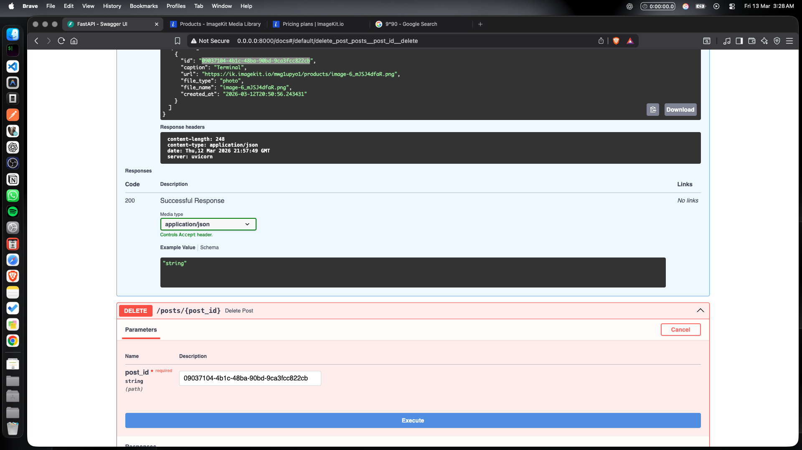
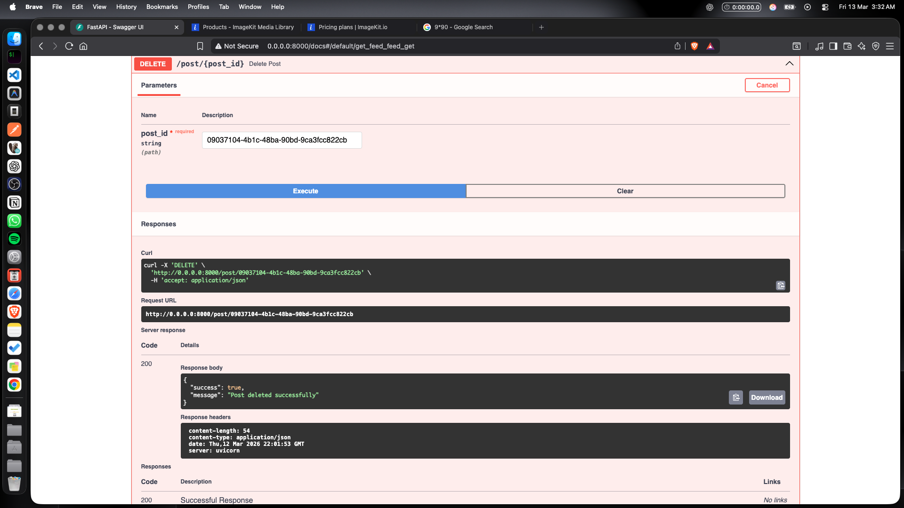 Deleted Success

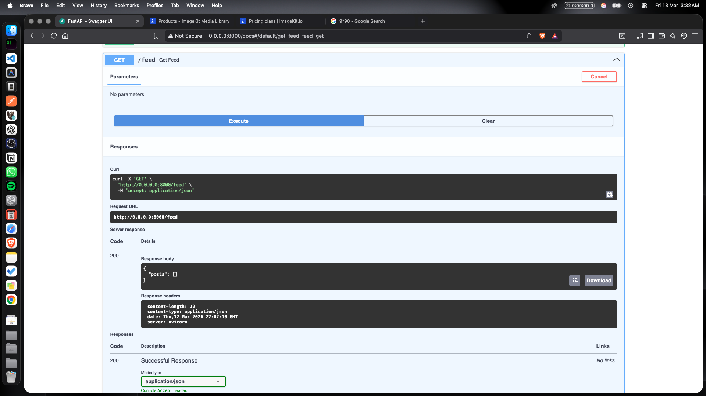 Not won't shown in GET

## User Authentication (FastAPI Users)

To secure the application with JWT, the `fastapi-users` library automates standard processes (registration, login, verifying tokens).

### Database Relationships
A **one-to-many** relationship links one user to many posts. The "child" (Post) holds the `ForeignKey` linking it to the parent (User).

```python
# db.py  # shows this line as part of the example output
from fastapi_users.db import SQLAlchemyBaseUserTableUUID, SQLAlchemyUserDatabase  # imports required names from module

class User(SQLAlchemyBaseUserTableUUID, Base):  # declares a class used by the app
    posts = relationship("Post", back_populates="user")  # assigns value for later use

# Update the Post class  # shows this line as part of the example output
class Post(Base):  # declares a class used by the app
    # ... existing fields ... | shows this line as part of the example output
    user_id = Column(UUID(as_uuid=True), ForeignKey("user.id"), nullable=False)  # assigns value for later use
    user = relationship("User", back_populates="posts")  # assigns value for later use

async def get_user_db(session: AsyncSession = Depends(get_async_session)):  # declares an async endpoint/helper
    yield SQLAlchemyUserDatabase(session, User)  # shows this line as part of the example output
```

### JWT Strategy and User Manager
Create a `users.py` file to handle authentication backend configuration. Note that `SECRET` should be a complex, unshared string used to encode tokens.

```python
# users.py  # shows this line as part of the example output
import uuid  # imports UUID helper for unique IDs
from typing import Optional  # imports required names from module
from fastapi import Depends, Request  # imports FastAPI classes used below
from fastapi_users import BaseUserManager, FastAPIUsers, UUIDIDMixin  # imports required names from module
from fastapi_users.authentication import AuthenticationBackend, BearerTransport, JWTStrategy  # imports required names from module
from app.db import User, get_user_db  # imports required names from module

SECRET = "super_secret_string"  # assigns value for later use

class UserManager(UUIDIDMixin, BaseUserManager[User, uuid.UUID]):  # declares a class used by the app
    reset_password_token_secret = SECRET  # assigns value for later use
    verification_token_secret = SECRET  # assigns value for later use
    
    # Custom hooks are supported (e.g., on_after_register) | shows this line as part of the example output

async def get_user_manager(user_db=Depends(get_user_db)):  # declares an async endpoint/helper
    yield UserManager(user_db)  # shows this line as part of the example output

bearer_transport = BearerTransport(tokenUrl="auth/jwt/login")  # assigns value for later use

def get_jwt_strategy() -> JWTStrategy:  # declares a helper or endpoint function
    # Set lifespan to 3600 seconds (1 hour) | shows this line as part of the example output
    return JWTStrategy(secret=SECRET, lifetime_seconds=3600)  # returns data to the API caller

auth_backend = AuthenticationBackend(  # assigns value for later use
    name="jwt",  # assigns value for later use
    transport=bearer_transport,  # assigns value for later use
    get_strategy=get_jwt_strategy  # assigns value for later use
)  # shows this line as part of the example output

fastapi_users = FastAPIUsers[User, uuid.UUID](  # assigns value for later use
    get_user_manager,  # shows this line as part of the example output
    [auth_backend]  # shows this line as part of the example output
)  # shows this line as part of the example output

current_active_user = fastapi_users.current_user(active=True)  # assigns value for later use
```
*Note: Token lifetime dictates how long a token is valid before requiring a re-login. Longer limits are convenient but pose security vulnerabilities.*

### Injecting Auth Routes
In `app.py`, inject the pre-built routing functionalities mapped to custom `UserRead`, `UserCreate`, and `UserUpdate` Pydantic schemas (inheriting from `schemas.BaseUser` in `schemas.py`).

```python
# app.py  # shows this line as part of the example output
from app.users import auth_backend, current_active_user, fastapi_users  # imports required names from module
from app.schemas import UserRead, UserCreate, UserUpdate  # imports required names from module

app.include_router(  # shows this line as part of the example output
    fastapi_users.get_auth_router(auth_backend), prefix="/auth/jwt", tags=["auth"]  # assigns value for later use
)  # shows this line as part of the example output
app.include_router(  # shows this line as part of the example output
    fastapi_users.get_register_router(UserRead, UserCreate), prefix="/auth", tags=["auth"]  # assigns value for later use
)  # shows this line as part of the example output
# Other routers like password reset and user routing can be appended similarly  # shows this line as part of the example output
```

### Protecting Endpoints
To make a route protected (requiring a user to be signed in), pass the `current_active_user` as a dependency.

```python
@app.post("/upload")  # registers a POST route
async def upload_file(  # declares an async endpoint/helper
    file: UploadFile = File(...),   # assigns value for later use
    caption: str = Form(...),   # assigns value for later use
    session: AsyncSession = Depends(get_async_session),  # assigns value for later use
    user: User = Depends(current_active_user) # Protects route and binds active user | assigns value for later use
):  # shows this line as part of the example output
    # Store user identity on the post payload | shows this line as part of the example output
    post = Post(..., user_id=user.id)  # assigns value for later use
```

Additionally, apply authorization logic within the function (e.g., verifying `post.user_id == user.id` before allowing deletions) to enforce user-specific permissions.

## ImageKit API URL Transformations
ImageKit allows real-time dynamic manipulation of files directly through query strings or URL paths, enhancing UI flexibility without reprocessing base files.
*   **Cropping/Sizing**: `tr=w-300,h-300` directly modifies width and height.
*   **Enhancements**: `tr=e-contrast` (increases contrast), `tr=e-sharpen` (sharpens image).
*   **Text/Overlays**: Add captions via URL string overlays, modifying sizes using attributes like `font-size_100`.
*   **Videos**: Output frames as thumbnails via appending `ik-thumbnail.jpg` (or requesting specific timeframes like 5 seconds in). Videos can also be cropped into vertical frames with blurred backgrounds, and drastically optimized (e.g., 90% quality compression makes files 3x smaller without major quality loss).

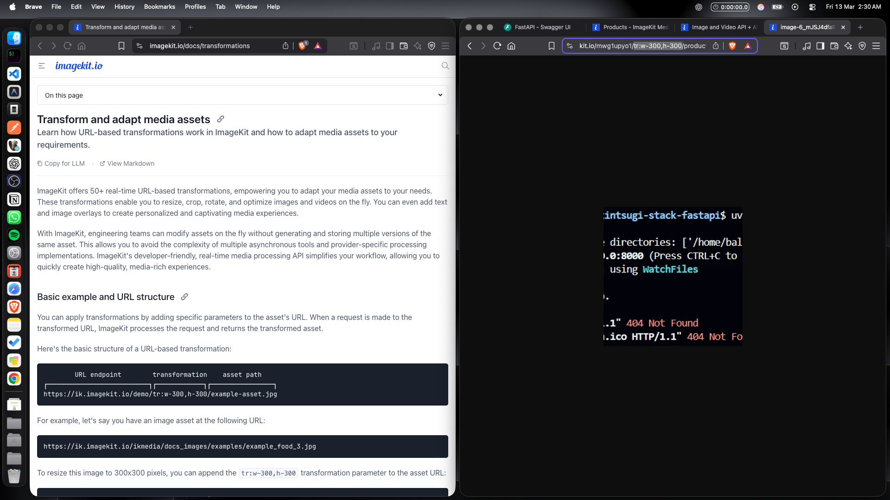

https://ik.imagekit.io/mwg1upyo1/products/image-6_mJSJ4dfaR.png to

- https://ik.imagekit.io/mwg1upyo1/products/image-6_mJSJ4dfaR.png?tr=w-300,h-300
- https://ik.imagekit.io/mwg1upyo1/tr=w-300,h-300/products/image-6_mJSJ4dfaR.png


## Front-End Integration (Streamlit context)
A simple frontend like Streamlit interfaces with the backend by executing HTTP operations mapped to the API. Once the backend successfully registers or logs in the user (`/auth/jwt/login`), the frontend saves the resulting access token into a session state. For any protected operations (like viewing the feed or uploading files), this token is included in the request headers (formatted as `Bearer <token>`).
